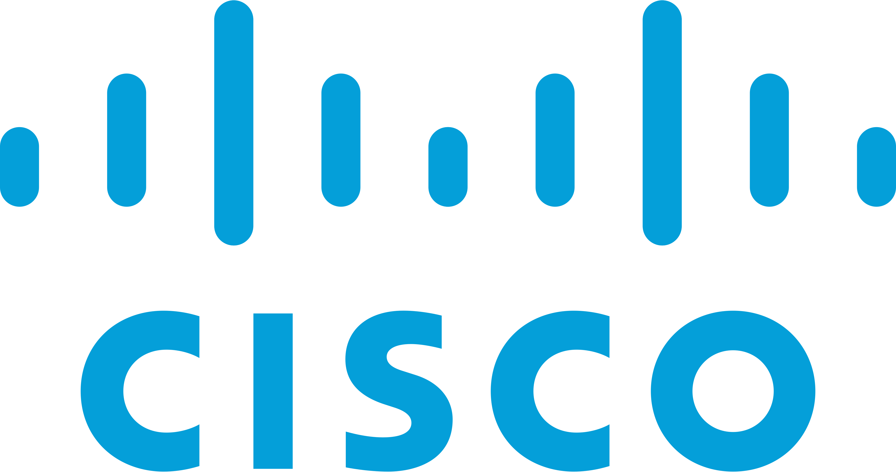

<p align="center">
  
</p>

<p align="center">
  
  
</p>

<br />

<p align="center">
Cisco Instructor, cybersecurity educator, and Front-End Developer focused on networking, ethical hacking, digital forensics, and modern web technologies.
</p>

<p align="center">
I teach cybersecurity and networking while building hands-on learning resources focused on GNU/Linux, Cisco IOS, ethical hacking, digital forensics, and web development.
</p>

<br>

<p align="center">
  <br>
  <sub>Cisco Networking Academy Instructor</sub>
</p>

<br>

<p align="center">
  <br>
  <sub>REUF Facilitator · SENCE</sub>
</p>

<br>

<h2 align="center">Tech Stack</h2>

<h3 align="center">Front-End</h3>

<p align="center">
  
</p>

<h3 align="center">Backend</h3>

<p align="center">
  
</p>

<h3 align="center">Databases</h3>

<p align="center">
  
</p>

<h3 align="center">Tools / DevOps</h3>

<p align="center">
  
</p>

<br>

<h2 align="center">Networking</h2>

<p align="center">
  
  
  
  
  
</p>

<br>

<h2 align="center">Cybersecurity</h2>

```bash
wh01s17@pwned:~$ echo $PROFILE
ROLE        : Cisco Networking Academy Instructor
TEACHING    : Cybersecurity & Digital Forensics
DEVELOPMENT : Front-End Developer
SECURITY    : Ethical Hacking
NETWORKING  : Cisco Networking
MODE        : CTF Player
SPECIALTY   : Pentesting

wh01s17@pwned:~$ tools --grouped
RECON        : Nmap, Gobuster, Dirb, ffuf
WEB TESTING  : Burp Suite
CREDENTIALS  : Hydra, John the Ripper, Hashcat
EXPLOITATION : Metasploit
NETWORK      : tcpdump, Wireshark
FORENSICS    : Volatility, Autopsy
REVERSING    : Ghidra

wh01s17@pwned:~$ echo $PLATFORMS
HackMyVM
VulnHub
Vulnyx

wh01s17@pwned:~$ sudo rm -rf / --no-preserve-root
permission denied: self-destruct disabled
```

<h2 align="center">Featured Projects</h2>

<table>
  <tr>
    <td width="50%" align="center" valign="top">
      <a href="https://wh01s17.com/blog" aria-label="Open the wh01s17 blog and portfolio">
        
      </a>
      <h3><a href="https://wh01s17.com/blog">wh01s17 Blog & Portfolio</a></h3>
      <p>A static-generated knowledge base with searchable CTF writeups, vulnerability notes, technical articles, RSS, and per-route SEO.</p>
      <p><code>Vue 3 · TypeScript · Vite SSG · Firebase</code></p>
      <p><a href="https://wh01s17.com/blog"><code>./read-blog</code></a></p>
    </td>
    <td width="50%" align="center" valign="top">
      <a href="https://sudoaprende.com/" aria-label="Open the sudoaprende.com learning platform">
        
      </a>
      <h3><a href="https://sudoaprende.com/">sudoaprende.com</a></h3>
      <p>An open interactive learning platform for GNU/Linux, Git, Cisco IOS, and cybersecurity with guided terminal exercises, pentesting labs, instant feedback, XP, achievements, and community rankings.</p>
      <p><code>Vue 3 · TypeScript · Supabase · Vitest</code></p>
      <p><a href="https://sudoaprende.com/"><code>./start-learning</code></a></p>
    </td>
  </tr>
</table>

<br>

<h2 align="center">GitHub Metrics</h2>

<p align="center">
  
  
  
</p>

<p align="center">
  
</p>

<h2 align="center">Activity</h2>

<p align="center">
  
</p>

<p align="center">
  <picture>
    <source media="(prefers-color-scheme: dark)" srcset="https://raw.githubusercontent.com/wh01s17/wh01s17/output/github-snake-dark.svg" />
    <source media="(prefers-color-scheme: light)" srcset="https://raw.githubusercontent.com/wh01s17/wh01s17/output/github-snake.svg" />
    
  </picture>
</p>
